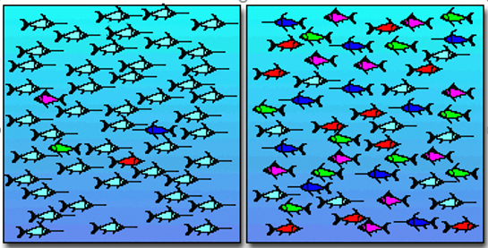

```{r setup, include=FALSE}
library(learnr)
library(mosaic)
library(vegan)
library(abdiv)

data(dune)
knitr::opts_chunk$set(echo = FALSE)
```

## Measuring biological diversity

The focus so far has been on analysing your data either with a statistical test or plotting your data to look at relationships, differences or patterns. But in biology and ecology, we often ask questions related to the distribution and contribution of different species to a community. We have seen with the ordination methods that we can reduced the dimensional of our species data into (relatively) easily interpretable figures where we can see sites are grouped together or that species close in ordination spaces are likely to co-occur. However, there times when it will be important to calculate a **diversity indices** for a sample, habitat or ecosystem. This often relates to understanding ecosystem health or monitoring complex communities over time and space. If our diversity metrics change in time and/ or space it will mean that the number of species and the relative abundance of these species are changing.

Ecological communities are complex. It is important to examine the diversity of communities for different reasons:

* monitoring
* ecological studies
* conservation
* exploitation

This means that we can start to ask questions related to what is driving the diversity of communities like:

* what is the long-term impact of nutrient loading on the diversity of macroalgae in an estuary?
* what is the relationship habitat heterogeneity and benthic diversity on the Antarctic Peninsula?
* does MPA designation increase diversity and ecosystem health compared to unprotected areas?
* what is the impact of a fisheries on pelagic diversity?

### What is species diversity?

Species diversity is an expression of community structure. Species diversity is split into two components: **species richness** and **species evenness**. Species richness is the total number of species in a quantified area or sample. Species evenness is the relative abundance of individuals within a community or sample. 

We can show what we mean by species richness and species evenness in the figure of two fish communities below. There are five species of fish in each community but there are differences in evenness. Which one is more diverse?



The answer is the community on the right. This is because, although there is the same species rich, each species in the community has a more even contribution to the abundance than the community on the left which is dominated by a single species.

We can see from this example that we need to consider both species richness and species evenness when we look at species diversity. We can combine species richness and evenness into a diversity indices which is a mathematical index for providing information on community composition. There are series of different diversity indices out there that take these two components into account when you calculate them, which we will cover.

## Species richness

Species richness is the most basic form of diversity indices. It is a measure of the number of species (or other taxonomic level when you cannot identify to species level) present at site or within a sample. Where you have a site with more species present you will have higher species richness than a site with fewer species present. Species richness tends to increase with the area and sampling effort so we need to be careful when we are comparing species richness between locations, habitats or samples because this effort will influence the number of species we find. This is because the longer we search for a species or the more samples we take from an area the more likely we are to encounter more species.

We can calculate species richness is a number of ways:

* total the number of species present in a sample,
* use an indices which takes into consideration sample size.

A useful species richness which takes into consideration sample size is **Margalef's index**. Margalef's index is based on the number of species present in given sample. More specifically Margalef's index takes into consideration that species richness increases with the total abundance.

$$S_{MG} = \frac{(S-1)}{lnN}$$

where S~MG~ is Margalef's index, _S_ is the number of species, _N_ the total abundance and _ln_ is the natural logarithm.

### Calculating species richness in R

Unfortunately, not all the packages available in R have a full suit of functions that calculate diversity indices. It may be that you have to pick and choose which packages you want to use depending on the diversity indices that you want to calculate.

```{r sr1, exercise = TRUE}
data(dune)

specnumber(dune)

View(dune)


margalef(dune$Achimill)
```

## Species diversity

Species diversity consists of two components: species richness and species evenness. Species evenness relates to the fact that within a community some species can be rare, common or dominant. When we calculate a species diversity index, we need to take into consideration the relative proportion of each species as well as the number of species present.

There are a lot of indices which you can use to calculate species diversity and there is still contention within the scientific community about which is the best to use. This is to do with the way species diversity indices deal with rare or dominant species. We will look at the 3 most commonly used indices that calculate species diversity in slightly different ways:

* Shannon-Wiener Index (H')
* Simpson's Index ($\lambda$)
* Berger-Parker Index

### Shannon-Wiener Index

Shannon-Wiener index (H') is the most commonly used species diversity index. H' represents the uncertainty associated with predicting the identity of a new species given the number of species and evenness of individuals within each species. We can think about this in the context of if we have a community with a single species then we can predict which species we will sample so our uncertainty will be 0. As the number of species in the community increases, we are less likely to predict which species we will sample which means our uncertainty will increase. H' ranges from 0 to 5 but usually falls between 1.5 and 3.5 with higher numbers indicating greater diversity.

H' has **three elements** which need to be considered when interpreting the index. These include: species richness (number of species in the sample), H' and evenness or equitability (J' or E).

H' can be calculated using the following formula:

$$H' = -\sum p_i *lnp_i$$

where _pi_ is the proportional abundance ( _p_ ) for _i_ th species and _ln_ is the natural logarithm.

J' (or E) is calculated using the following formula:

$$J' = H'/lnS$$

where _S_ is the number of species.

J' has a value between 0 and 1. The logic with this index of evenness is that if you remove species richness by dividing _H'_ by _lnS_ you will be left with species evenness. The closer _J'_ is to 1 the more equally abundance each species. 

H' increases with species richness and evenness but it puts more weight on species richness when calculating H' value. The result is that H' can increase when there are more species **OR** where the relative abundance of the different species is more even. This is why it is important to present H', J' and S together to help with the interpretation.

### Simpson's Index ($\lambda$)

Simpson's index ($\lambda$) considers both species richness and evenness **but** is weighted towards the **commonest** or **most dominant species**. It is often referred to as a dominance index and differs to H' which is more influenced by species richness. $\lambda$ considers the probability that two individuals picked at random from an infinitely large community will belong to the same species. Because it is more likely that the dominant species will be sampled, this index is weighted towards the most abundant species.  

We can calculate $\lambda$ by:

$$lambda = 1 -\sum {p_i}^2 $$

where _pi_ is the proportional abundance ( _p_ ) for _i_ th species.

### Berger-Parker Index

Berger-Parker index (d) is a very simple index of dominance. it expresses the proportional abundance of the commonest species.

It can be calculated by:

$$d = \frac{Nmax}{N} $$

where _Nmax_ is the number of individuals in the most abundance species and _N_ is the total number of individuals in a sample. It is often expressed as its reciprocal _1/d_. This means that as the value for _1/d_ increases there is a decrease in dominance and therefore an increase in evenness.

### Calculating species diversity in R

There is no one package that is the best to choose for calculating species diversity when it comes doing it in R. We have used the `vegan` package a lot and this has a function `diversity()` which will calculate H` and $\lambda$. However, if you want J', then you will have to calculate this yourself.

```{r sd1, exercise = TRUE}
data(dune)
diversity(dune, index = "shannon")

```

